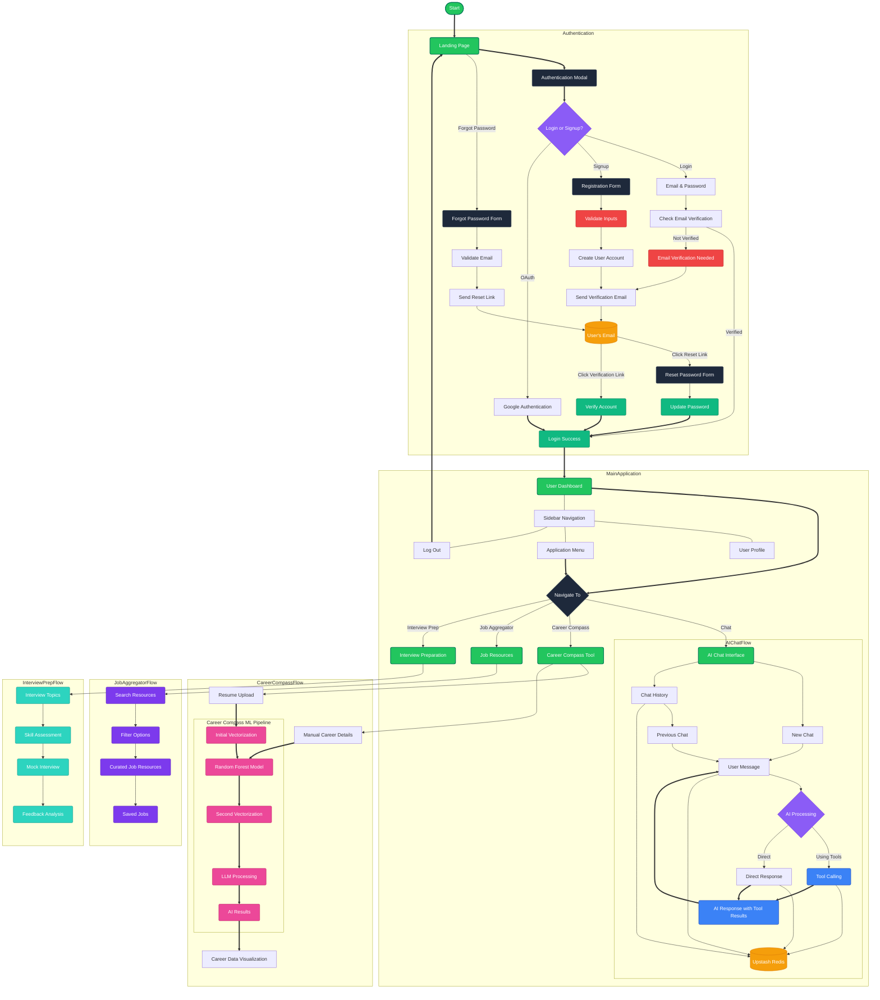

# Employment Opportunities Application Flow

This diagram visualizes the complete user flow in the Employment Opportunities application, from authentication to using the AI-powered features.

## Key User Flows

1. **Authentication**
   - Users can sign in with email/password or Google OAuth
   - New users can register and must verify their email
   - Password reset functionality is available

2. **Dashboard Navigation**
   - Central dashboard with access to all application features
   - Persistent sidebar for navigation between sections

3. **AI Chat Experience**
   - Users can start new chats or continue previous conversations
   - AI processes user messages and may use special tools
   - All chat data is persisted in Upstash Redis database
   - Responses are rendered back to users in a conversational interface

4. **Career Compass**
   - Two input methods with different processing paths:
     - Resume Upload: Goes through full ML pipeline (vectorization → Random Forest → second vectorization → LLM)
     - Manual Details: Bypasses vectorization (directly to Random Forest → LLM)
   - Provides career data visualization from AI analysis results

5. **Job Aggregator**
   - Search and filter job resources
   - Curated job listings from multiple sources
   - Save favorite job opportunities

6. **Interview Preparation**
   - Topic selection for interview practice
   - Skill assessment to identify strengths and weaknesses
   - Interactive mock interviews
   - Detailed feedback and improvement analysis